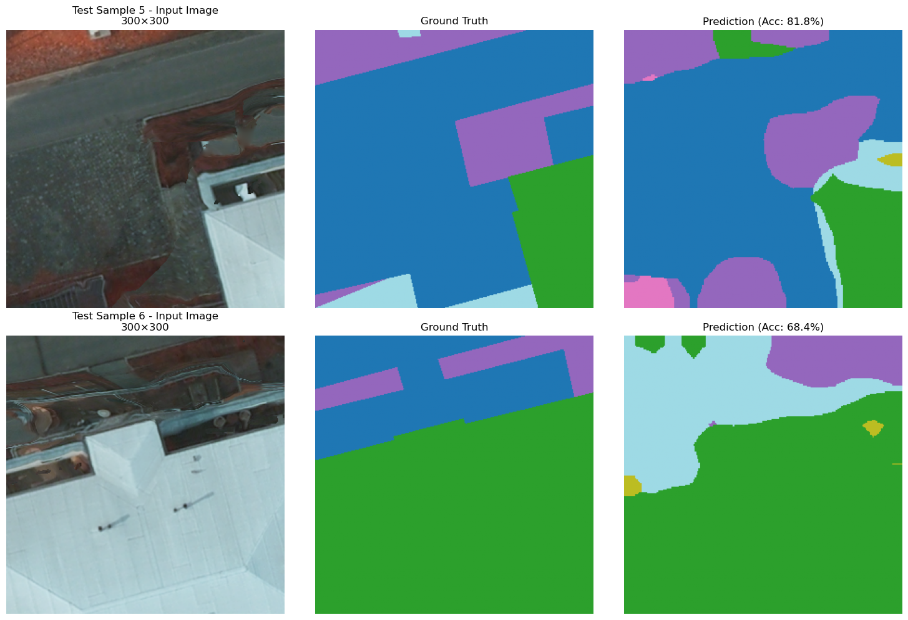
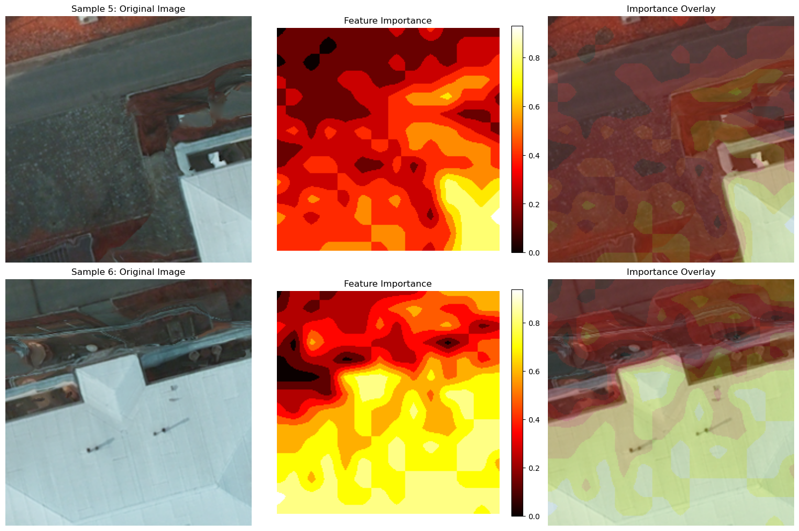

# ViT Semantic Segmentation on Potsdam

Semantic segmentation of ISPRS Potsdam aerial imagery with a frozen Vision Transformer (ViT-S/16)
encoder and a convolutional decoder.

**Joshua Owen Mangotang**, Deep Learning for Computer Vision, University of South Brittany, 2026.

<p align="center">
  
  <br><em>Test tiles: input, ground truth and prediction.</em>
</p>

## Overview

| | |
| --- | --- |
| **Data** | ISPRS Potsdam, 6 classes (roads, buildings, low vegetation, trees, cars, clutter): 2,400 tiles of 300 x 300 px resized to 224 x 224, split into 1,680 training, 480 validation and 240 test tiles |
| **Encoder** | ViT-S/16 (`torchgeo.models.vit_small_patch16_224`), frozen |
| **Decoder** | four 3 x 3 convolutions (512, 512, 256, 256 channels) with batch norm, a 1 x 1 classifier and bilinear upsampling to 224 x 224 |
| **Training** | Adam (lr 1e-3, halved on plateau), class-weighted cross-entropy, 20 epochs, about 33 minutes on a GTX 1650 |

> **Note on the encoder.** The notebook was meant to use DINO weights pretrained on Sentinel-2
> imagery (SSL4EO-S12). The checkpoint's keys carry a `backbone.` prefix and its patch embedding
> has 13 input bands, so `load_state_dict(strict=False)` skipped every weight. The encoder behind
> these results is therefore randomly initialised, and only the decoder learned. The results are
> kept as they were produced.

## Results

Pixel accuracy on the test set, ignoring unlabelled pixels:

| Roads | Buildings | Low vegetation | Trees | Cars | Clutter | **Overall** |
| ----: | --------: | -------------: | ----: | ---: | ------: | ----------: |
| 69.0% | 74.1% | 59.2% | 69.4% | 81.7% | 36.5% | **64.9%** |

Classes with clear shapes and edges (cars, buildings) score highest; clutter, the most varied
class, stays hard even with class weighting. The notebook also shows feature importance maps and
the training curves:

<p align="center">
  
</p>

## Repository Structure

```
vit_potsdam_segmentation.ipynb   data loading, decoder training, evaluation and visualisations
assets/                          figures used in the notebook and this README
requirements.txt
```

## Usage

1. Get the [ISPRS Potsdam dataset](https://www.isprs.org/resources/datasets/benchmarks/UrbanSemLab/2d-sem-label-potsdam.aspx)
   and place the 300 x 300 GeoTIFF tiles in `dataset/potsdam/Images/` and
   `dataset/potsdam/Labels/`.
2. Download the DINO ViT-S/16 Sentinel-2 checkpoint (`B13_vits16_dino_0099_ckpt.pth`, "full
   ckpt") from the [SSL4EO-S12 repository](https://github.com/zhu-xlab/SSL4EO-S12) into
   `weights/`.
3. Install the requirements and run the notebook:

```bash
pip install -r requirements.txt
jupyter lab vit_potsdam_segmentation.ipynb
```

## References

- ISPRS 2D Semantic Labeling Contest, Potsdam dataset.
- Dosovitskiy et al. (2021). An Image Is Worth 16x16 Words: Transformers for Image Recognition at Scale. ICLR.
- Caron et al. (2021). Emerging Properties in Self-Supervised Vision Transformers. ICCV.
- Wang et al. (2023). SSL4EO-S12: A Large-Scale Multimodal, Multitemporal Dataset for Self-Supervised Learning in Earth Observation. IEEE Geoscience and Remote Sensing Magazine.

## License

[MIT](LICENSE)
